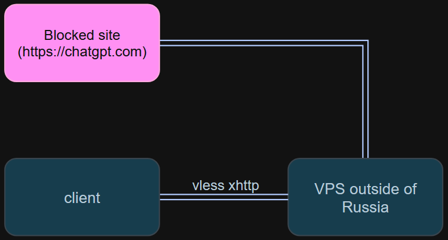
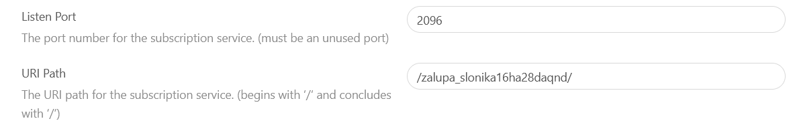
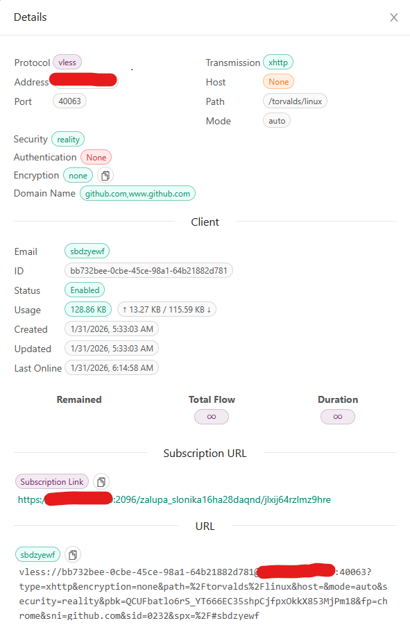
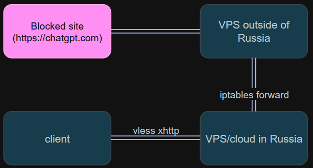
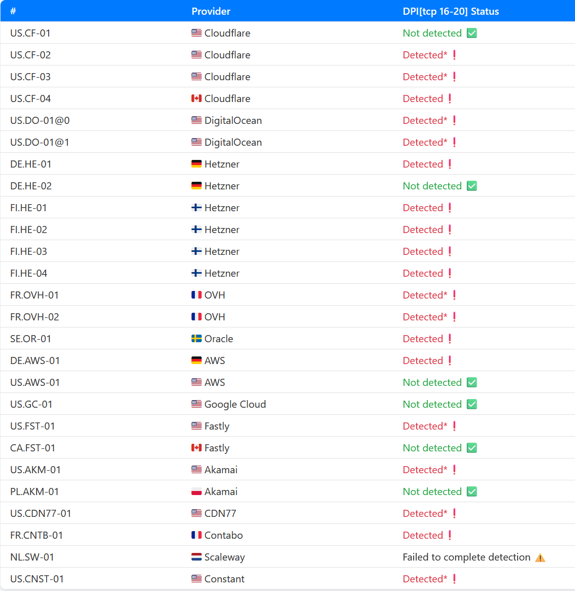
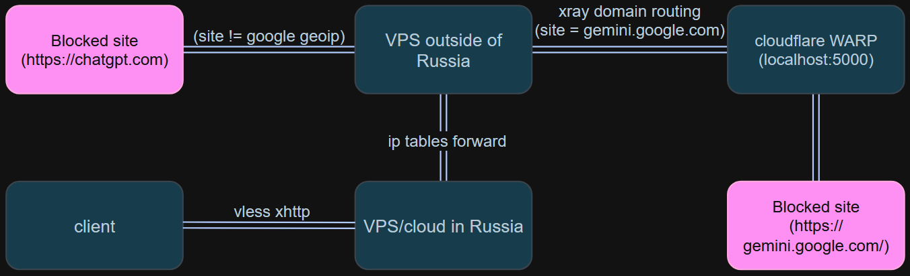
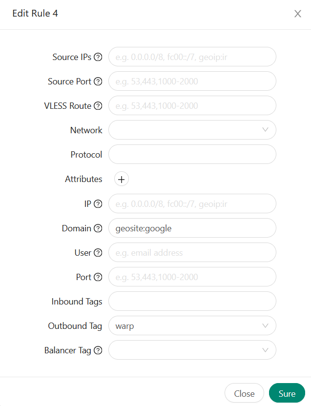
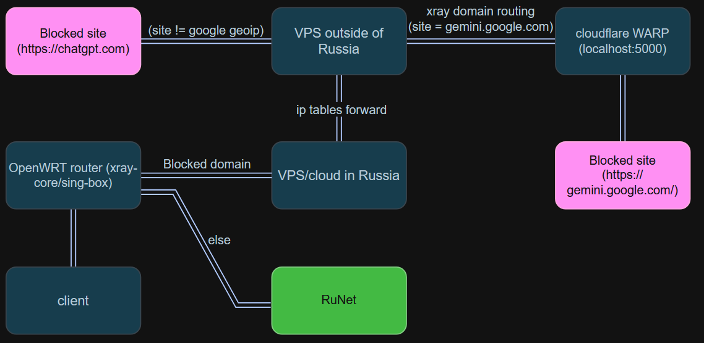
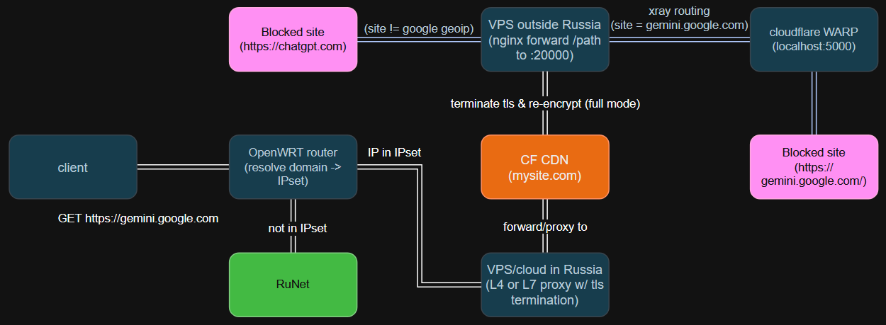

# Обход блокировок в 2026 - обзор доступных методов


В этой статье описаны различные актуальные на 2026 год способы обхода блокировок - начиная от простых сетапов и постепенно дополняя до более сложных. Также будут описаны актуальные на февраль 2026-го алгоритмы блокировок, применяемые цензорами.

Подразумевается, что у вас уже арендован и настроен VPS (или несколько). Для настройки VPS наберите следующий текст в свою любимую LLM. Рекомендую [lmarena](https://arena.ai) (gemini/gpt/grok/claude)

<details>
  <summary>Текст для LLM</summary>
	Debian 12  
	Дай пошаговую инструкцию по минимальной настройке VPS - создание пользователя, защиту SSH, конфигурацию ufw итд
</details>

[1/5 Direct](#15-direct-client---euvps) ·
[2/5 Cascade](#25-cascade-client---ruvps---euvps) ·
[3/5 WARP](#35-cloudflare-warp-client---ruvps---euvps---warp) ·
[4/5 Split-Tunneling](#45-client-split-tunneling-on-router-openwrt) ·
[5/5 CDN](#55-cdn-client---ruvps---cdn---euvps---warp)

##### [Ссылки](#полезные-ссылки)

---

## 1/5 Direct (client -> euVPS)


Базовый сетап. Клиент подключается напрямую к зарубежному VPS. При активных мобильных БС не будет работать. На проводном подключении уже подвергается шейпингу [по описанному здесь сценарию](https://github.com/net4people/bbs/issues/490). По сути применяется грубая эвристика - IP-адрес из зарубежной подсети + размер данных переданных в одном TCP-соединении превышает 15кб -> режем трафик. При этом некоторые зарубежные подсети из критической инфраструктуры в белом списке. Это довольно эффективно - цензору не нужно заморачиваться с обнаружением протоколов.

### Настройка чистого xray-core + конфиг vless-xhttp-reality
Установим xray с помощью [скрипта-установщика](https://github.com/XTLS/Xray-install)

Скрипт скачает и установит бинарник xray-core (`/usr/local/bin/xray`), создаст директорию с конфигом (`/usr/local/etc/xray`), директорию для geoip.dat файлов (`/usr/local/share/xray`), создаст systemd сервис для автоматического запуска
```shell
bash -c "$(curl -L https://github.com/XTLS/Xray-install/raw/main/install-release.sh)" @ install
```

Сгенерируем ключи для авторизации клиента и шифрования
```shell
# uuid для авторизации vless клиента
xray uuid

# tls ключи, privateKey - сервер, password - клиент
xray x25519
```

Возьмем шаблон конфига из репозитория с [примерами конфигов](https://github.com/XTLS/Xray-examples) (комментарии нужно убрать)

```shell
{
    "inbounds": [
        {
            "listen": "0.0.0.0",
            "port": 443, // порт 443 для маскировки
            "protocol": "vless",
            "settings": {
                "clients": [
                    {
                        "id": "", // id для авторизации клиента, полученное с xray uuid
                        "flow": ""
                    }
                ],
                "decryption": "none"
            },
            "streamSettings": {
                "network": "xhttp",
                "xhttpSettings": {
                    "path": "/yourpath" // укажите свой секретный путь, например /torvalds/linux
                },
                "security": "reality",
                "realitySettings": {
                    "target": "example.com:443", // сайт, под который "маскируется" reality во время tls хендшейка, например github.com:443
                    "serverNames": [
						// список доступных SNI target
						// используйте команду xray tls ping github.com, чтобы получить допустимый список для хоста
						// пример: "github.com", "www.github.com"
                    ],
                    "privateKey": "", // "private key" полученный с xray x25519
                    "shortIds": [ // используется для идентификации конкретного клиента
                        // "", // с этим значением на клиенте можно не заполнять shordId
                        "00" // длина должна быть кратна 2, от 2 до 16 символов, символы 0-9, a-f
                    ]
                }
            },
            "sniffing": {
                "enabled": true,
                "destOverride": [
                    "http",
                    "tls",
                    "quic"
                ]
            }
        }
    ],
    "outbounds": [
        {
            "protocol": "freedom",
            "tag": "direct"
        },
        {
            "protocol": "blackhole",
            "tag": "block"
        }

    ]
}
```

Если вдруг поехало форматирование json файла
```shell
jq . config.json > fixed.json && mv fixed.json config.json
```

Отредактируем файл конфига
```shell
cd /usr/local/etc/xray # путь по умолчанию, если использовали скрипт-установщик
sudo vim config.json # :wq - записать и выйти
```

Проверим конфиг и перезапустим xray
```shell
xray -test -c /usr/local/etc/xray/config.json

sudo systemctl restart xray
sudo systemctl status xray # должно быть без ошибок
```


В голом xray-core нет возможности генерации ссылки для подключения, но это можно сделать вручную, подставив нужные значения
```shell
vless://uuid@ip:port?encryption=none&host=github.com&fp=chrome&mode=auto&path=/torvalds/linux&pbk=password&security=reality&sid=shortid&sni=github.com&type=xhttp
```

В качесте десктопного графического клиента можно использовать, например, [Throne](https://github.com/throneproj/Throne)

Во всех клиентах под капотом используют либо тот же бинарник xray-core, либо sing-box (код которого лучше оптимизирован). Для использования достаточно импортировать ссылку подключения.

Мобильные клиенты - V2RayNG, Happ, Hiddify.

### Панель 3X-UI
3X-UI - графическая панель, тулинг для xray-core, позволяет создавать конфиги в UI, генерировать ссылки и QR-коды подключения для клиентов, а также добавляет функционал подписок - ссылок, с помощью которых клиент всегда может получить актуальную версию конфигов. 

<details>
  <summary>Если вы устанавливали 3X-UI до этого</summary>
  В старых версиях установочного скрипта 3X-UI было сразу несколько способов выстрелить себе в ногу. Панель шла с кредами admin/admin, по http, сервис подписок включен по умолачанию по известному пути /sub/. Есть неплохая вероятность, что ваша панель скомпроментирована
</details>

Используем установычный скрипт с [официального репозитория 3x-ui](https://github.com/MHSanaei/3x-ui)
```shell
# перед запуском скрипта поменяем пользователя на root
sudo -i

# установим acme для управления сертификатами
apt update && apt upgrade -y
apt install -y curl wget socat cron
curl https://get.acme.sh | sh -s email=myvpnxxx@gmail.com # email может быть любым, но домен должен быть реальным
/root/.acme.sh/acme.sh --set-default-ca --server letsencrypt

# нужно открыть порт 80 для установки сертификата
ufw allow 80/tcp

# установочный скрипт
bash <(curl -Ls https://raw.githubusercontent.com/mhsanaei/3x-ui/master/install.sh)
```

Установочный скрипт предложит вам задать порт и установить сертификат LetsEncrypt. Установка сертификата в новых версиях 3x-ui теперь обязательна - домен покупать для этого не нужно, достаточно выбрать опцию `Let's Encrypt for IP Address (6-day validity, auto-renews)`

В новых версиях, по умолчанию будут сгенерированы случайные имя пользователя, пароль, порт и секретный путь. На выходе увидим:
```shell
═══════════════════════════════════════════
     Panel Installation Complete!
═══════════════════════════════════════════
Username:    user
Password:    pass
Port:        port
WebBasePath: secret_path
Access URL:  https://ip:port/secret_path

# сохраните выдачу и не забудьте открыть порт, выбранный для панели
ufw allow xxx/tcp
```

После входа в панель, следует сменить путь для подписок с дефолтного /sub/ на что-то более секретное в Panel Settings -> Subscription. Также смените listen port и не забудьте его открыть. Либо если вам не нужен функционал подписок, отключите subscription service.



Для дополнительной безопасности можно включить двухфакторную аутентификацию в Panel Settings -> Authentication -> Two-factor authentication.

Теперь накликаем такой же инбаунд, как в конфиге сырого xray-core выше


* Listen IP - 0.0.0.0 - хотим слушать на всех интерфейсах
* Port - рекомендован 443 для маскировки
* Protocol - протокол аутентификации, vless - самый актуальный
* Transmission - транспорт (как передаем данные: tcp/websocket/grpc/xhttp)
* Path - путь, по которому делаем запрос grpc/xhttp/websocket
* Security - протокол шифрования
* uTLS - под какой браузер маскируемся
* Target - с какого домена reality берет сертификат и прочие данные для tls хендшейка
* SNI - список допустимых доменов для target - xray tls ping github.com (используется в client hello и для получения конкретного сертификата от target)
* Short IDs - используется для идентификации клиентов
* Public Key - публичный ключ tls - xray x25519 "password"
* Private Key - приватнывй ключ tls - xray x25519 "private key"

После добавления инбаунда, можем нажать на плюсик рядом с ним - тут можно получить QR-код для подключения клиентов, либо информацию: ссылку на конфиг, ссылку на подписку


В клиент можно импортировать как ссылку конфига (URL), так и ссылку подписки (Subscription URL). В случае с подпиской при изменении настроек инбаунда либо добавлении/удалении инбаундов для этого клиента, клиент может автоматически обновить конфиги по ссылке подписки, в случае с ссылкой на конфиг - ему придется отправить новую ссылку.

Также по ссылке подписки можно переходить - по ней будет лендинг для конкретного uuid клиента c QR-кодом, ссылками на приложения-клиенты на Android и iOS, список всех конфигов-ссылок для клиента, а также данные по трафику.


### Панель Remnawave
[Remnawave](https://github.com/remnawave/panel) - инструмент для оркестрации множества VPS (control plane) с xray-core (Remnawave node). Remnawave позволяет поднимать сколько угодно серверов с Remnawave node и управлять всеми с единого сервера-панели.

У инструмента много различных фич и возможностей, дополнительно можно ознакомиться по [ссылке](https://docs.rw/docs/learn-en/quick-start).

---

## 2/5 Cascade (client -> ruVPS -> euVPS)


В каскадном сетапе клиент стучится на VPS в РФ, этот VPS роутит трафик на зарубежный VPS.
* Если VPS в РФ имеет IP-адрес *из белого списка* - мы получаем обход как белых списков мобильного интернета, так и обход шейпинга трафика от ТСПУ на проводном интернете
* Если VPS в РФ имеет IP-адрес *не из белого списка* - мы обычно получаем обход шейпинга трафика от ТСПУ на проводном интернете. Почему? Видимо, алгоритмы шейпинга развернуты еще не на всех коробках ТСПУ либо намеренно развернуты не в полную силу на ISP хостингов и дц

### Шейпинг трафика к зарубежным IP
Проверить, использует ли ваш ISP шейпинг трафика к зарубежным подсетям [можно тут](https://hyperion-cs.github.io/dpi-checkers/ru/tcp-16-20/)
Для убедительности прикладываю два скрина
* C обычного VPS в РФ (не из БС) - доступны практически все IP
* С моего проводного ISP (SkyNet) - заблокированы практически все IP

VPS РФ


SkyNet ISP


На практике это выглядит так, что больше половины зарубежных сайтов не открываются. Почти чебурнет, но все еще есть к чему стремиться.

### Белые списки, эталон, к которому будем стремиться
Как работают белые списки
* CIDR - блокировка доступа к IP-адресам не из указанного диапозона (123.123.123.123/24)
* SNI - блокировка подключений с SNI отличным от белого списка (ya.ru, vk.com)

Как можно обойти?
* В диапозоны разрешенных IP-адресов попадают адреса критической инфраструктуры (yandex, vk, ozon, wb и т.д.)
* В списки разрешенных SNI попадают соответствующие им домены
* Идея - выловить IP-адрес из белого списка у крупных поставщиков IaaS (yandex cloud, vk cloud), использовать соответствующий поставщику "белого" IP-адреса SNI в Reality

Ограничения
* Поставщики IaaS начали активно блокировать пользователей за перебор IP-адресов и за использование их сервисов для обхода блокировок
* Операторы сотовой связи улучшают белые списки, убирая лишние диапозоны БС
* В конечном итоге обход БС будет невозможен, поэтому их обход скорее временное явление

Я не буду описывать процесс подбора IP-адреса из белого списка - в остальном, настройка VPS с IP-адресом из БС аналогична настройке VPS в РФ с обычном IP-адресом.

### Настройка промежуточного VPS c iptables (тупой прокси)
Промежуточный VPS будет перехватывать пакеты от клиента и перенаправлять их на зарубежный VPS - для этого нам нужен только iptables. Преимущество решения в максимальной простоте и минимальном использовании ресурсов.

```bash
#!/bin/bash

VPS2_IP="123.123.123.123" # IP зарубежного VPS
TARGET_PORT="443" # порт инбаунда vless на зарубежном сервере
LOCAL_PORT="443" # локальный порт
SSH_PORT="22" # порт SSH

# Включим перенаправление пакетов (IP Forwarding)
sudo sysctl -w net.ipv4.ip_forward=1
echo 'net.ipv4.ip_forward = 1' | sudo tee /etc/sysctl.d/99-ipforward.conf
sudo sysctl -p /etc/sysctl.d/99-ipforward.conf

sudo apt update
sudo apt install iptables iptables-persistent

# Сбросим все правила к дефолтным (ACCEPT), чтобы не потерять доступ в процессе
sudo iptables -P INPUT ACCEPT
sudo iptables -P FORWARD ACCEPT
sudo iptables -P OUTPUT ACCEPT
sudo iptables -F
sudo iptables -t nat -F
sudo iptables -X
sudo iptables -t nat -X

sudo iptables -A INPUT -i lo -j ACCEPT
sudo iptables -A INPUT -m conntrack --ctstate ESTABLISHED,RELATED -j ACCEPT
sudo iptables -A INPUT -p tcp --dport "$SSH_PORT" -j ACCEPT

# Все что пришло на LOCAL_PORT, отправляем на VPS2:TARGET_PORT
# TCP
sudo iptables -t nat -A PREROUTING -p tcp --dport "$LOCAL_PORT" -j DNAT --to-destination "$VPS2_IP:$TARGET_PORT"
# UDP (для QUIC)
sudo iptables -t nat -A PREROUTING -p udp --dport "$LOCAL_PORT" -j DNAT --to-destination "$VPS2_IP:$TARGET_PORT"

# Подменяем IP клиента на IP этого VPS
# Это нужно, чтобы VPS2 отвечал этому VPS, а не пытался ответить клиенту напрямую
sudo iptables -t nat -A POSTROUTING -p tcp -d "$VPS2_IP" --dport "$TARGET_PORT" -j MASQUERADE
sudo iptables -t nat -A POSTROUTING -p udp -d "$VPS2_IP" --dport "$TARGET_PORT" -j MASQUERADE

# Разрешаем прохождение переадресованных пакетов
sudo iptables -A FORWARD -m conntrack --ctstate ESTABLISHED,RELATED -j ACCEPT
sudo iptables -A FORWARD -p tcp -d "$VPS2_IP" --dport "$TARGET_PORT" -j ACCEPT
sudo iptables -A FORWARD -p udp -d "$VPS2_IP" --dport "$TARGET_PORT" -j ACCEPT

# Блокируем все остальное
sudo iptables -P INPUT DROP
sudo iptables -P FORWARD DROP

sudo netfilter-persistent save
sudo netfilter-persistent reload
```

Конфиг xray остается неизменным за исключением IP-адреса и порта - нужно указать адрес промежуточного VPS и порт, с которого переадресуем пакеты.

### Настройка промежуточного VPS с HAProxy + балансировка
HAProxy - reverse proxy и балансировщик нагрузки. Удобно, если у вас несколько зарубежных VPS и вы хотите максимального аптайма.

Установка и настройка
```shell
sudo apt update
sudo apt install haproxy -y

sudo vim /etc/haproxy/haproxy.cfg

# Секцию global оставить как есть

defaults
        log     global
        mode    tcp # L4 проксирование
        option  tcplog
        option  dontlognull
        timeout connect 5000 # таймаут на установку соединения с бекенд хостами, мс
        timeout client  50000 # таймаут ожидания следующих данных от клиента
        timeout server  50000 # таймаут ожидания данных от сервера

# слушаем 443 и перенаправляем на указанный бекенд
frontend vless-in
    bind *:443
    default_backend vless-single-node

# бекенд с одним хостом, только для переадресации
backend vless-single-node
    mode tcp
    
    # healthcheck
    # inter 10s - проверять каждые 10 секунд
    # fall 3 - если 3 раза подряд ошибка, считаем сервер мертвым
    # rise 2 - если 2 раза подряд ок, считаем живым
    # HAProxy не будет пытаться стучаться в мертвый сервер в отличии от iptables
    server vps_eu 123.123.123.123:443 check inter 10s fall 3 rise 2
    
# бекенд с множеством хостов, балансировка
backend vless-nodes
    mode tcp
    
    # Доступные алгоритмы балансировки
    # leastconn - выбирает хост с меньшим количеством установленных соединений
    # roundrobin - по очереди
    # source - привязывает IP клиента к серверу (клиент с одним IP всегда попадает на один и тот же сервер)
    # random - случайный выбор
    balance leastconn
    
    server vps_eu1 111.111.111.111:443 check inter 5s fall 3 rise 2
    server vps_eu2 112.112.112.112:443 check inter 5s fall 3 rise 2
    server vps_eu3 113.113.113.113:443 check inter 5s fall 3 rise 2

# статистика (необязательно)
listen stats
    bind :8404
    mode http
    stats enable
    stats uri /stats
```

Проверим конфиг и перезапустим
```shell
sudo haproxy -c -f /etc/haproxy/haproxy.cfg
sudo systemctl restart haproxy
```

### Промежуточный прокси с xray-core
В предыдущих вариантах использовали "тупые" L4-прокси, которые знают только при IP:port. Опишу сценарий использования xray-core в качестве промежуточного VPS.

Промежуточный VPS у нас в ДЦ РФ - зачастую они не шейпят трафик до того же youtube, к тому же на ютубе нет рекламы для ру сегмента, поэтому на промежуточном VPS будем
* Принимать трафик на inbound vless xhttp reality (tls termination)
* Если домен geosite:youtube или geosite:ru -> отправлять на direct аутбаунд (т.е. пойдем на ютуб с VPS РФ)
* Все остальное -> отправляем на аутбаунд зарубежного VPS (tag proxy)

Конфиг будет выглядеть так
```shell
{
    "inbounds": [
        {
            "listen": "0.0.0.0",
            "port": 443, // порт 443 для маскировки
            "protocol": "vless",
            "settings": {
                "clients": [
                    {
                        "id": "", // id для авторизации клиента, полученное с xray uuid
                        "flow": ""
                    }
                ],
                "decryption": "none"
            },
            "streamSettings": {
                "network": "xhttp",
                "xhttpSettings": {
                    "path": "/yourpath" // укажите свой секретный путь, например /torvalds/linux
                },
                "security": "reality",
                "realitySettings": {
                    "target": "example.com:443", // сайт, под который "маскируется" reality во время tls хендшейка, например github.com:443
                    "serverNames": [
						// список доступных SNI target
						// используйте команду xray tls ping github.com, чтобы получить допустимый список для хоста
						// пример: "github.com", "www.github.com"
                    ],
                    "privateKey": "", // "private key" полученный с xray x25519
                    "shortIds": [ // используется для идентификации конкретного клиента
                        // "", // с этим значением на клиенте можно не заполнять shordId
                        "00" // длина должна быть кратна 2, от 2 до 16 символов, символы 0-9, a-f
                    ]
                }
            },
            "sniffing": {
                "enabled": true,
                "destOverride": [
                    "http",
                    "tls",
                    "quic"
                ]
            }
        }
    ],
	"outbounds": [
	{
	  "protocol": "vless",
		"settings": {
			"vnext": [
			  {
				"address": "123.123.123.123", // IP зарубежного VPS
				"port": 443, // порт
				"users": [
				  {
					"id": "uuid", // uuid для аутентификации vless
					"encryption": "none",
					"flow": ""
				  }
				]
			  }
			]
			},
			"streamSettings": {
			"network": "xhttp",
			"xhttpSettings": {
			  "path": "/torvalds/linux" // путь xhttp
			},
			"security": "reality",
			"realitySettings": {
			  "serverName": "github.com",
			  "publicKey": "password", // password с xray x25519
			  "shortId": "00", // short id клиента
			  "fingerprint": "chrome"
			}
			},
			"tag": "proxy"
			},
			{
			"protocol": "freedom",
			"tag": "direct"
			},
			{
			"protocol": "blackhole",
			"tag": "block"
			}
	],
	"routing": {
		"domainStrategy": "AsIs",
		"rules": [
		  {
			"type": "field",
			"domain": ["geosite:youtube, geosite:ru"],
			"outboundTag": "direct"
		  },
		  {
			"type": "field",
			"outboundTag": "proxy"
		  }
		]
  }
}
```

В 3x-ui
* Добавьте vless xhttp reality инбаунд
* Добавьте аутбаунд зарубежного VPS: Xray configs -> Outbounds -> Add outbound -> JSON -> Link (tag proxy)
* Обновите Routings rules: Domain: geosite:youtube. geosite:ru, Outbound Tag: proxy

Подробнее про маршрутизацию в xray можно почитать в [доке](https://xtls.github.io/ru/document/level-1/routing-lv1-part1.html)

Минусы данного подхода в высоких накладных расходах на tls termination, дополнительное шифрование и дешифрование данных (client ⇄  VPS1 ⇄ VPS2 ⇄ HTTPS).

---

## 3/5 Cloudflare WARP (client -> ruVPS -> euVPS -> WARP)


WARP - сервис от cloudflare, что-то вроде VPN, но не совсем. Допустим, вы находитесь в Германии и делаете запрос к сайту, что находится в США.
* WARP направляет трафик в ближайшую ноду Cloudflare в Германии
* Оттуда трафик летит по приватной сети Cloudflare и выходит в оптимальной ноде
* С ноды CF в США идет запрос на сайт
* Возвращается ответ по такому же пути

Отсюда название WARP - пакеты как бы телепортируются через частную сеть CF, минуя стандартный путь через сеть сетей - роутеров национальных и глобальных ISP.

Но использовать WARP мы будем по другой причине. Регион IP-адреса арендованного зарубежного VPS может в некоторых сервисах (например, google) определяться как Китай или Иран. В таком случае у нас не будет доступа, например, к google gemini. WARP поможет нам "отбелить" такой IP-адрес. При этом, мы не хотим весь трафик маршрутизировать через WARP, для этого используем routing правила xray-core на зарубежном VPS.

Проверить регионы вашего VPS можно через [скрипт](https://github.com/vernette/ipregion):
```shell
# перед запуском рекомендую прочитать скрипт (либо вбить в LLM) и форкнуть себе
bash <(wget -qO- https://raw.githubusercontent.com/vernette/ipregion/refs/heads/master/ipregion.sh)
```

Установка и настройка WARP на зарубежном VPS
```shell
# add warp gpg key
curl -fsSL https://pkg.cloudflareclient.com/pubkey.gpg | gpg --yes --dearmor --output /usr/share/keyrings/cloudflare-warp-archive-keyring.gpg

# add warp repo
echo "deb [signed-by=/usr/share/keyrings/cloudflare-warp-archive-keyring.gpg] https://pkg.cloudflareclient.com/ $(lsb_release -cs) main" | sudo tee /etc/apt/sources.list.d/cloudflare-client.list

# install
apt update
apt install cloudflare-warp

# register warp
echo "y" | warp-cli registration new
# mode socks proxy
WARP_PORT=6000
warp-cli mode proxy
warp-cli proxy port $WARP_PORT
# connect
warp-cli connect
```

Добавим routing правила в конфиг (чистый xray-core)
```shell
{
    "inbounds": [
        {
            "listen": "0.0.0.0",
            "port": 443, // можно заменить на 22/23 - иногда помогает обойти шейпинг
            "protocol": "vless",
            "settings": {
                "clients": [
                    {
                        "id": "", // id для авторизации клиента, полученное с xray uuid
                        "flow": ""
                    }
                ],
                "decryption": "none"
            },
            "streamSettings": {
                "network": "xhttp",
                "xhttpSettings": {
                    "path": "/yourpath" // укажите свой секретный путь, например /torvalds/linux
                },
                "security": "reality",
                "realitySettings": {
                    "target": "example.com:443", // сайт, под который "маскируется" reality во время tls хендшейка, например github.com:443
                    "serverNames": [
						// список доступных SNI target
						// используйте команду xray tls ping github.com, чтобы получить допустимый список для хоста
						// пример: "github.com", "www.github.com"
                    ],
                    "privateKey": "", // "private key" полученный с xray x25519
                    "shortIds": [ // используется для идентификации конкретного клиента
                        // "", // с этим значением на клиенте можно не заполнять shordId
                        "00" // длина должна быть кратна 2, от 2 до 16 символов, символы 0-9, a-f
                    ]
                }
            },
            "sniffing": {
                "enabled": true,
                "destOverride": [
                    "http",
                    "tls",
                    "quic"
                ]
            }
        }
    ],
    "outbounds": [
        {
            "protocol": "freedom",
            "tag": "direct"
        },
        {
            "protocol": "blackhole",
            "tag": "block"
        },
        {
            "protocol": "socks",
            "settings": {
                "servers": [
                    {
                        "address": "127.0.0.1",
                        "port": $WARP_PORT
                    }
                ]
            },
            "tag": "warp"
        }
    ],
    "routing": {
        "rules": [
            {
                "outboundTag": "warp",
                "domain": [
                    "geosite:google-deepmind"
                ]
            }
        ]
    }
}
```

Также WARP можно настроить для панели 3x-ui:
 * Создадим WARP outbound - Xray configs -> Outbounds -> WARP -> Create -> Add
 * Routing rules -> Add rule -> (Domain: geosite:google, gemini.google.com, Outbound tag: warp)
 * Включите sniffing в настройках инбаунда, чтобы работал роутинг по доменам



Маршрутизация в xray-core похожа на L3 Data Plane
* Пакет поступает на один из входящих интерфейсов (секция inbounds), и в зависимости от правил маршрутизации (секция routing), отправляется в соответствующий исходящий интерфейс (секция outbounds)
* Для идентификации конкретного inbound/outbound используются теги
* На скрине читается: если домен из списка доменов google, отправить пакет на outbound с тегом "warp"

Подробнее про маршрутизацию - в официальной документации

---

## 4/5 Client split tunneling on router (OpenWRT)


Настройка туннелирования на роутере обладает рядом преимуществ:
* Трафик туннелируется для всех клиентов роутера, нет необходимости ставить клиентов на каждый девайс
* Можно использовать на рабочих ноутбуках

Процесс прошивки конкретной модели роутеров описан на официальном сайте OpenWRT. Для целей раздельного туннелирования подойдут не все роутеры - рекомендуется как можно более "жирный" роутер (процессор, память, диск) с простым процессом прошивки и поддержкой, например [GL.iNet GL-MT6000](https://openwrt.org/toh/gl.inet/gl-mt6000)

### Podkop
Существует готовое решение для настройки split tunnel на роутерах OpenWRT - [podkop](https://github.com/itdoginfo/podkop)

Далее будет описан способ ручной настройки через nftables, ip route/rule и dnsmasq + dnscrypt-proxy.

### Установка последней версии xray-core

Скачаем и распакуем файлы
```shell
opkg update
opkg install unzip

cd /tmp
# замените на актуальную версию и архитектуру процессора
# uname -m
# aarch64	arm64-v8a
# armv7l	arm32-v7a
# mipsel	mipsle
wget https://github.com/XTLS/Xray-core/releases/download/v26.1.23/Xray-linux-arm64-v8a.zip
unzip Xray-linux-arm64-v8a.zip

mkdir -p /etc/xray
mv geoip.dat geosite.dat /etc/xray/
mv xray /usr/bin/xray
chmod +x /usr/bin/xray
```

Настроим сервис
```shell
vim /etc/init.d/xray
# вставьте содержимое
```

```shell
#!/bin/sh /etc/rc.common

START=99
STOP=10
USE_PROCD=1

PROG=/usr/bin/xray
CONFIG=/etc/xray/config.json

start_service() {
    procd_open_instance
    procd_set_param command $PROG run -c $CONFIG
    procd_set_param env XRAY_LOCATION_ASSET=/etc/xray
    procd_set_param respawn
    procd_set_param stdout 1
    procd_set_param stderr 1
    procd_set_param file $CONFIG
    procd_close_instance
}

stop_service() {
    killall xray 2>/dev/null
}

reload_service() {
    stop
    start
}
```

Конфиг клиента vless xhttp (комментарии нужно убрать)
```shell
vim /etc/xray/config.json

{
  "inbounds": [
    {
      "tag": "tproxy-in", // transparent proxy inbound
      "protocol": "dokodemo-door",
      "listen": "::",
      "port": 4444,
      "settings": {
        "network": "tcp,udp",
        "followRedirect": true
      },
      "streamSettings": {
        "sockopt": {
          "tproxy": "tproxy",
          "tcpFastOpen": true
        }
      },
      "sniffing": {
        "enabled": true,
        "destOverride": ["http", "tls", "quic"]
      }
    },
    {
      "tag": "test-socks", // socks inbound для тестирования
      "listen": "0.0.0.0",
      "port": 1080,
      "protocol": "socks",
      "settings": {
        "udp": true
      }
    }
  ],
  "outbounds": [
    {
      "protocol": "vless",
      "settings": {
        "vnext": [
          {
            "address": "123.123.123.123", // IP VPS в РФ
            "port": 443, // порт, который "слушаем" на VPS в РФ
            "users": [
              {
                "id": "uuid", // uuid для аутентификации vless
                "encryption": "none",
                "flow": ""
              }
            ]
          }
        ]
      },
      "streamSettings": {
        "network": "xhttp",
        "xhttpSettings": {
          "path": "/torvalds/linux" // путь xhttp
        },
        "security": "reality",
        "realitySettings": {
          "serverName": "github.com",
          "publicKey": "password", // password с xray x25519
          "shortId": "00", // short id клиента
          "fingerprint": "chrome"
        }
      },
      "tag": "proxy"
    },
    {
      "protocol": "freedom",
      "tag": "direct"
    },
    {
      "protocol": "blackhole",
      "tag": "block"
    }
  ]
}
```

Проверим конфиг, включим и запустим сервис
```shell
/usr/bin/xray -test -c /etc/xray/config.json

chmod +x /etc/init.d/xray
/etc/init.d/xray enable
/etc/init.d/xray start
```

Проверим работоспособность конфига + сервера
```shell
curl https://ifconfig.me # увидим свой IP
curl --socks5-hostname 127.0.0.1:1080 https://ifconfig.me # должны увидеть IP зарубежного VPS
```
После можно удалить ненужный socks инбаунд.


В конфиге используется transparent proxy inbound (tproxy), который существенно быстрее TUN-интерфейса: трафик перехватывается на уровне ядра и направляется напрямую в сокет xray, без дополнительного прохождения через виртуальный сетевой интерфейс tun.

### Маршрутизация пакетов ip rule/route
Все пакеты с меткой `0x1` будем отправлять в таблицу маршрутизации tproxy
Все пакеты попавшие в таблицу tproxy переадресуем себе же на loopback

```shell
vim /etc/iproute2/rt_tables
# добавим в конец
100 tproxy


vim /etc/config/network

# эквивалентно ip rule add fwmark 0x1 lookup tproxy priority 100
# сохраняется между перезагрузками
config rule
        option mark '0x1'
        option priority '100'
        option lookup 'tproxy'

# эквивалентно ip route add local 0.0.0.0/0 dev lo table tproxy
config route
        option interface 'loopback'
        option table 'tproxy'
        option target '0.0.0.0/0'
        option type 'local'

service network restart

ip rule show # -> 100: from all fwmark 0x1 lookup tproxy
ip route show table tproxy # -> local default dev lo scope host
```

### Метка пакетов nftables
Создадим ipset с IP-адресами подсетей, которые хотим пускать в туннель. Все пакеты с destIP из этого сета, будем помечать меткой `0x1`, а также прозрачно перенаправлять на порт `4444`. Сам пакет при этом не модифицируется

```shell
cd /etc/nftables.d/
vim 30-tproxy.nft

# содержимое

# переменная со списком заранее заданных подсетей отсюда
# https://github.com/itdoginfo/allow-domains
# например, возьмем подсети Discord - subnets / ipv4 / discord.lst
define vpn-subnets = {
 138.128.136.0/21, 162.158.0.0/15, 172.64.0.0/13,
 34.0.0.0/15, 34.2.0.0/15, 35.192.0.0/12,
 35.208.0.0/12, 5.200.14.128/25, 66.22.192.0/18
}

# объявим ipset и заполним его значениями с переменной
set vpn-ipset {
        type ipv4_addr
        flags interval, timeout
        auto-merge

        elements = $vpn-subnets
}

# метчим все tcp/udp пакеты с интерфейса "br-lan" (заменить на название своего) и с destIP из IP сета
chain tproxy_prerouting {
        type filter hook prerouting priority mangle; policy accept;
        iifname "br-lan" ip daddr @vpn-ipset meta l4proto { tcp, udp } tproxy ip to :4444 meta mark set 0x1 accept
}

# также можно метчить все пакеты с локального интерфейса (кроме тех, что предназначаются локально самому роутеру)

#chain tproxy_prerouting {
#       type filter hook prerouting priority mangle; policy accept;
#       iifname "br-lan" fib daddr type local accept
#       iifname "br-lan" meta l4proto { tcp, udp } tproxy ip to :4444 meta mark set 0x1 accept
#}

service firewall restart

nft list sets table inet fw4 # показать сеты таблицы
nft flush set inet fw4 vpn-ipset # сбросить сет
nft add element inet fw4 vpn-ipset { x, y } # добавить элементы
```

Имеем на данный момент:
* Все пакеты с меткой `0x1` будут отправлены на сокет xray-core
* Все пакеты из IP сета vpn-ipset будут помечены меткой `0x1`
* Можем помечать все пакеты вне зависимости от адреса назначения (для дебага)

### Маршрутизация по списку доменов
Остался последний штрих - хотим указать список доменов, чтобы шли через туннель.

Для этого используем dnsmasq (установлен по умолчанию) - dhcp-сервер и dns форвардер/кэшер. В конфиге dnsmasq нужно указать название IP сета, куда будут складываться IP-адреса зарезолвленные с указанного списка доменов.

Сделать это можно через панель Luci - перейдя в Network -> DHCP & DNS -> IP Sets -> Add
* Name of the set - название IP сета созданного в nftables (vpn-ipset)
* FQDN - домен второго уровня, по одному. При указании, например, google.com, будет резолвить также домены следующих уровней: maps.google.com, drive.google.com

Либо через конфиг 
```shell
vim /etc/config/dhcp

config ipset
	option table 'fw4'
	option table_family 'inet'
	list name 'vpn-ipset'
	list domain 'chatgpt.com'
	
service dnsmasq restart
```

Панель в данном случае использовать удобнее - если наткнулись на заблокированный ресурс, можно зайти в панель и быстро добавить домен в список.

### Защита DNS-запросов - dnscrypt-proxy2
По умолчанию dnsmasq использует plaintext DNS-резолвер от DHCP-сервера оператора связи, т.е. оператор видит и может блокировать DNS-запросы к определенным доменам. Используем прокси-форвардер dnscrypt-proxy2 для шифрования DNS-запросов

```shell
opkg update && opkg install dnscrypt-proxy2

vim /etc/dnscrypt-proxy2/dnscrypt-proxy.toml
# пример настройки
server_names = ['google', 'cloudflare', 'scaleway-fr']
listen_addresses = ['127.0.0.53:53']
dnscrypt_servers = false
doh_servers = true
odoh_servers = false
require_nolog = true

# проверка
service dnscrypt-proxy restart
nslookup github.com 127.0.0.53:53
```

Настроим dnsmasq на использование dnscrypt-proxy2
```shell
config dnsmasq
    ...
    option noresolv '1' # игнорировать днс-резолвер от ISP
    option cachesize '0' # кэширование включено в dnscrypt-proxy
    option localuse '1'
    list server '127.0.0.53#53' # listen_address в dnscrypt-proxy
    
service dnsmasq restart
```

---

## 5/5 CDN (client -> ruVPS -> CDN -> euVPS -> WARP)

Какую проблему решает CDN (Content delivery network)? Представьте, что вы находитесь в США и делаете запрос к сайту в Германии:
* Байты запросы разделяются на пакеты
* Пакет идет по системе роутеров, объединенных с другими роутерами (сеть сетей), используя алгоритмы OSPF, BGP
* Региональные сети объединены в национальные, а те в свою очередь в глобальные (Tier1) - сети платят за доставку пакетов "выше"
* Таким образом пакет пройдет через немалое количество сетей, и в итоге по глобальной сети между континентами

Роутить пакеты таким образом медленно и дорого, CDN решают эту проблему собственной частной сетью, которой не нужно платить за трафик глобальным ISP, а также кэшированием данных в различных ДЦ по всему миру и предоставлением услуги облачного reverse proxy. Тот же запрос будет выглядеть с CDN примерно так:
* DNS CDN отдает IP-адрес ближайшего к пользователю хоста (региональная сеть, IXP)
* Если ответ на запрос уже закэширован, сразу отдаем пользователю, не выходя из региональной сети
* Если ответа нет в кэше, CDN заберет их с оригинального сервера по своей частной сети, после обновит кэш
* В итоге: минимальная задержка (round-trip time), минимальная нагрузка на оригинальный сервер, дешевый трафик, DDoS-защита

Идея с использованием CDN схожа с идеей подбора "белых" IP для обхода БС мобильных операторов связи. Есть какая-то критическая инфраструктура интернета, которую блокировать не хочется или по крайней мере хочется не всегда - тогда цензор ее пропускает. 

Для начала нужно ответить на вопрос, что нам дает этот метод? Учитывая, что проводные ISP уже применяют шейпинг трафика к большинству CDN, эффективно блокируя к ним доступ. Дает еще одно возможное "окно", возможный способ обхода ограничений. 

В качестве CDN будем использовать бесплатный аккаунт Cloudflare. У данного метода есть существенное ограничение - его нельзя использовать с Reality, т.к. мы идем через сервера CF - серверу нужен настоящий SNI в ClientHello, чтобы идентифицировать конкретный домен. Если не считать domain fronting, который прикрыли на большинстве CDN, - для роутинга на конкретный домен используется не SNI, а http host header.

Для минимального работающего сетапа, вам понадобится домен и VPS с IP-адресом. При регистрации в CF, у вас будет инструкция по настройке DNS, поэтому описывать я это не буду. На этом этапе у вас уже должен быть домен, зареганный в CF с включенным оранжевым облаком в DNS -> Records.

### Настройка CF
**SSL/TLS режимы**
 * Off - шифрование отключено. Клиент стучится в http CF домен, CF стучится в http сервер с plaintext
 * Flexible - шифрование только client <-> CF, на VPS необязательно, CF стучится в http сервер с plaintext, на VPS сертификат не нужен, в инбаундах xray-core можно использовать security: "none"
 * Full - полное шифрование client <-> CF <-> VPS. В данном случае необходимы ключи tls на VPS
 * Full (Strict) - то же самое, только нужен сертификат (authority, что подтвердит принадлежность домена именно этому IP)

WebSockets/gRPC
* Websocket - включен по умолчанию, нужен для ws транспорта
* gRPC - нужен для транспортов gRPC и xhttp


Опишу настройку с использованием режима Full (strict) и транспорта WS. На сервере есть сертификат, крутится веб-сервер под nginx. 

Конфиг зарубежного VPS, добавим дополнительный inbound
```shell
{
  "listen": "127.0.0.1", # важно, перед сервером стоит nginx, который терминирует tls и отправляет на 127.0.0.1:20000
  "port": 20000,
  "protocol": "vless",
  "settings": {
	"clients": [
	  {
		"id": "" # xray uuid
	  }
	],
	"decryption": "none"
  },
  "streamSettings": {
	"network": "ws",
	"security": "none", # не используем шифрование, nginx терминирует tls и передает plaintext локально
	"wsSettings": {
	  "path": "/search" # свой путь, nginx редиректит на локальный порт запросы по этому пути
	}
  }
}
```

Проверим и перезапустим
```shell
sudo xray -test
sudo systemctl restart xray
```

Конфиг nginx - на этом этапе у вас уже должен быть конфиг сайта с сертификатом в /etc/nginx/sites-available/mysite, в итоге должно выглядеть примерно так:
```shell
server {
	listen 443 ssl http2; # managed by Certbot
	
    server_name   mysite.com www.mysite.com;

    ssl_certificate /etc/letsencrypt/live/mysite.com/fullchain.pem; # managed by Certbot
    ssl_certificate_key /etc/letsencrypt/live/mysite.com/privkey.pem; # managed by Certbot
    include /etc/letsencrypt/options-ssl-nginx.conf; # managed by Certbot
    ssl_dhparam /etc/letsencrypt/ssl-dhparams.pem; # managed by Certbot

    # Бекенд сайта-заглушки
    location / {
        proxy_pass         http://localhost:7000;
        proxy_http_version 1.1;
        proxy_set_header   Upgrade $http_upgrade;
        proxy_set_header   Connection keep-alive;
        proxy_set_header   Host $host;
        proxy_cache_bypass $http_upgrade;
        proxy_set_header   X-Forwarded-For $proxy_add_x_forwarded_for;
        proxy_set_header   X-Forwarded-Proto $scheme;
    }

    # Vless WS - добавляем этот блок
    location /search {
        proxy_redirect off;
        proxy_pass http://127.0.0.1:20000;

        proxy_http_version 1.1;
        proxy_set_header Upgrade $http_upgrade;
        proxy_set_header Connection "upgrade";

        proxy_set_header Host $host;
        proxy_set_header X-Real-IP $remote_addr;
        proxy_set_header X-Forwarded-For $proxy_add_x_forwarded_for;
        proxy_set_header X-Forwarded-Proto https;

        proxy_read_timeout 600s;
        proxy_send_timeout 600s;
    }
}
```

Проверим и перезапустим
```shell
sudo nginx -t
sudo systemctl restart nginx
```

Экспортируем добавленный инбаунд в клиент и проверим работоспобность подключения напрямую
```shell
# обратите внимание на security=tls - на клиенте нужно шифрование
vless://uuid@mysite.com:443?encryption=none&security=tls&type=ws&path=/search&host=mysite.com&sni=mysite.com&fp=chrome#VLESS-WS-TLS-CF
```

Теперь используем его в качестве аутбаунда на промежуточном сервере.

3X-UI - Xray Configs
* Outbounds -> Add -> Json -> Link
* Routing rules -> Add -> Inbound (выберите уже настроенный инбаунд), Outbound (VLESS-WS-TLS-CF)
* Save & restart

Настроить промежуточный VPS с L4 проксированием по iptables/HAProxy на CF можно аналогично уже описанному процессу.

## Полезные ссылки
* Примеры конфигов xray-core (github.com) - https://github.com/XTLS/Xray-examples
* Документация xray-core (github.io) - https://xtls.github.io/ru/
* Суверенный интернет, обсуждение (4pda.to) - https://4pda.to/forum/index.php?showtopic=1110469
* Глобальный форум по исследованию интернет-цензуры (github.com) - https://github.com/net4people/bbs/issues
* Русскоязычный форум по исследованию интернет-цензуры (есть только IPv6 запись днс, для доступа используйте Tor поверх VPN) (ntc.party) - https://ntc.party/
* Инструмент для раздельного туннелирования на роутерах OpenWRT (podkop.net) - https://podkop.net/
* Проверка подключения на БС и шейпинг трафика (github.com) - https://github.com/hyperion-cs/dpi-checkers
